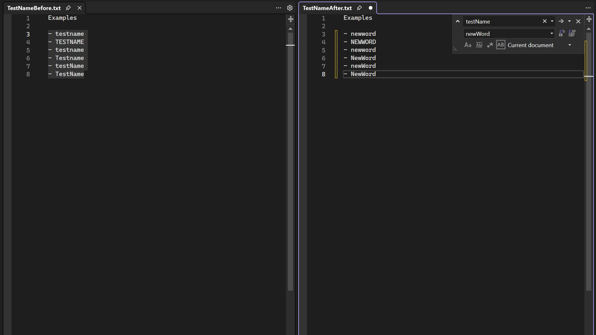

Když provedete funkci Nahradit, můžete v kódu zachovat původní velikost textu každé shody. Všimněte si, že pokud chcete získat písmena Pascal a Camel case, váš řetězec Nahradit musí být v písmenu Pascal nebo Camel case. 

Zachovejte velikost písmen v okně Nahradit `Alt+V` nebo kliknutím na možnost _Zachovat velikost písmen_. 

Rychlé nahrazení (`Ctrl+H`):

Nahradit v souborech (`Ctrl+Shift+H`): 

Podělte se o své myšlenky na prostředí funkce Nahradit se zachováním malých a velkých písmen na tomto lístku komunity Developer Community: [Funkce Vyhledat a nahradit se zachováním velkých a malých písmen napříč více soubory](https://developercommunity.visualstudio.com/t/case-preserving-search-replace/580810).
