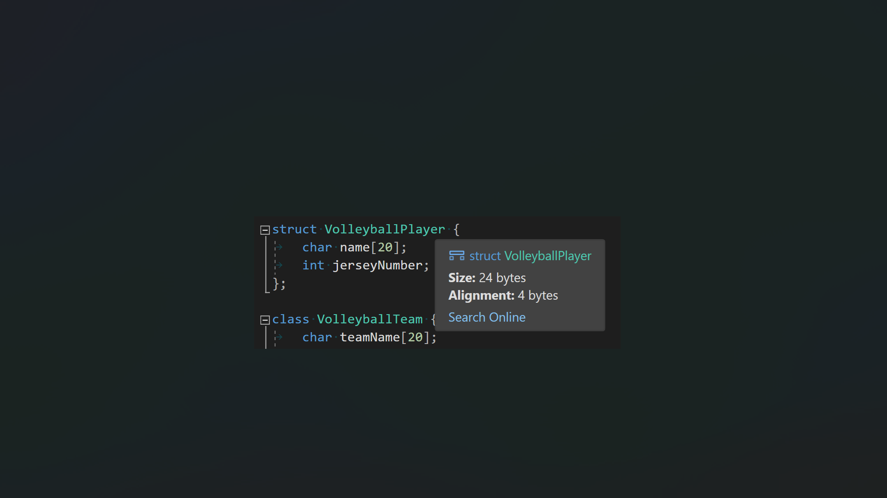
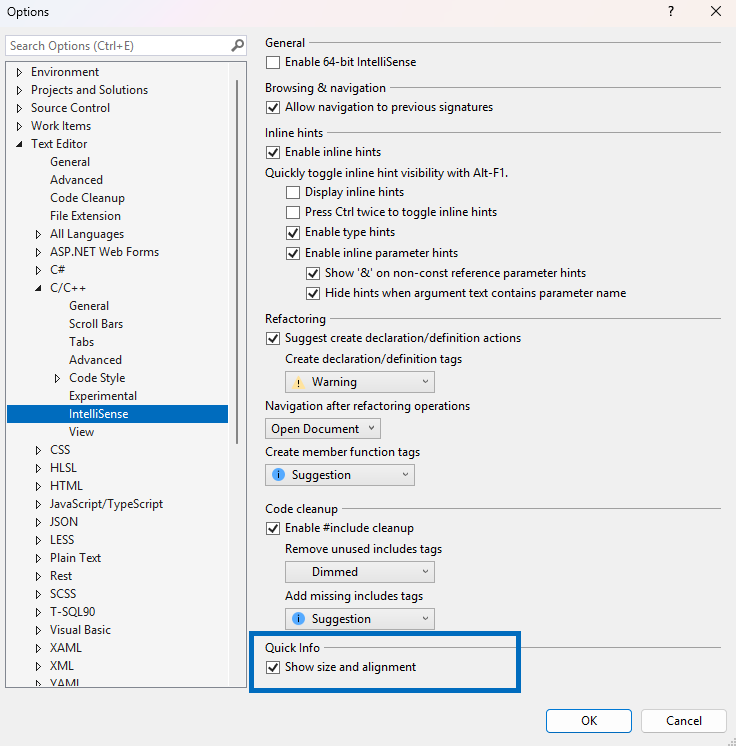

V jazyce C++ můžete rychle zkontrolovat velikost a zarovnání tříd, struktur, sjednocení, základních typů a výčtů tak, že najedete myší na jejich názvy. Když najedete myší na názvy tříd, struktur nebo sjednocení kdekoli, kde se zobrazí v kódu, eliminujete tak nutnost posouvání a vyhledávání jejich deklarací, abyste měli přístup k podrobnostem o jejich velikosti a zarovnání.

Tato funkce je ve výchozím nastavení zapnutá. Pokud chcete získat přístup k nastavení, přejděte na Nástroje > Možnosti > Textový editor > C/C++ > IntelliSense.

