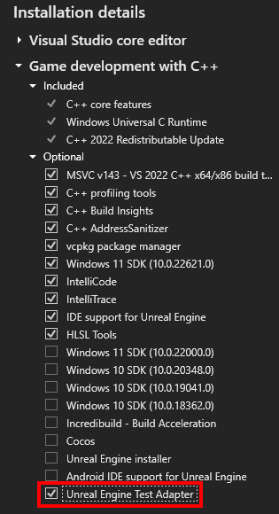

V sadě Visual Studio teď můžete spravovat a spouštět testy Unreal Engine. 

Pokud chcete zajistit, aby byl adaptér testů Unreal Engine správně povolený, přesvědčte se, že je v instalačním programu pro Visual Studio v úloze „Vývoj her pomocí jazyka C++“ vybraný „Adaptér testu Unreal Engine“. Vyžaduje se také modul plug-in Unreal Engine [nástroj pro integraci sady Visual Studio](https://learn.microsoft.com/visualstudio/gamedev/unreal/get-started/vs-tools-unreal-install).

Po instalaci adaptéru testů UE se vaše testy Unreal Engine automaticky zobrazí při otevření sady Visual Studio. Pokud chcete zobrazit své testy, můžete otevřít průzkumníka testů pomocí aplikace {KeyboardShortcut:TestExplorer.ShowTestExplorer}. S novým adaptérem unreal Engine Test Adapter můžete snadno spravovat a spouštět testy.
