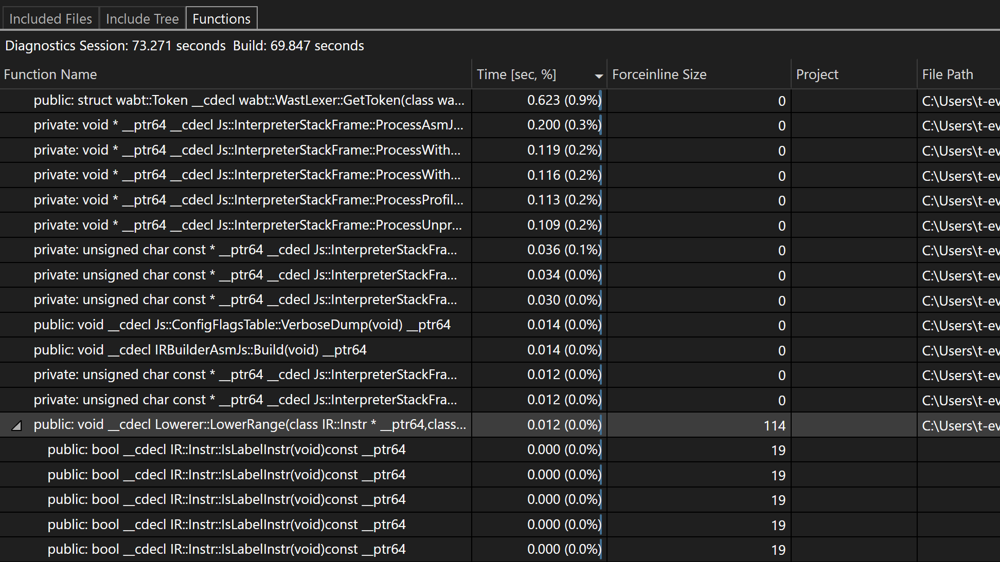

[Build Insights](https://devblogs.microsoft.com/cppblog/introducing-c-build-insights/) ist jetzt mit Visual Studio 2022 integriert! Sie können nun zusätzliche Informationen zur Funktionsgenerierung anzeigen. In der neuen Funktionsansicht sehen Sie, wie lange die Kompilierung einer Funktion dauert, sowie die Anzahl der zugeordneten forceinline-Elemente.

Um sicherzustellen, dass Build Insights ordnungsgemäß aktiviert ist, sollten Sie überprüfen, ob im Visual Studio-Installer unter den Workloads „Desktopentwicklung mit C++“ oder „Spieleentwicklung mit C++“ die Option „Build Insights für C++“ aktiviert ist.

Starten Sie ihre ETL-Ablaufverfolgungserfassung in Build Insights mit einem Klick auf eine Schaltfläche. 

Nach der Kompilierung erstellt Build Insights einen Diagnosebericht, der die Generierungszeit der Funktion sowie die forceinline-Elemente enthält.

Wir sind bestrebt, Build Insights kontinuierlich zu verbessern. Die aktuelle Integration von Build Insights, die Sie heute sehen, stellt nur einen Bruchteil dessen dar, was wir für Sie auf Lager haben. Welche Workflows sind für Sie wichtig? Bitte teilen Sie uns dies in diesem [Entwicklercommunity-Ticket](https://developercommunity.visualstudio.com/t/Have-full-integration-of-Build-Insights/810960) mit.
