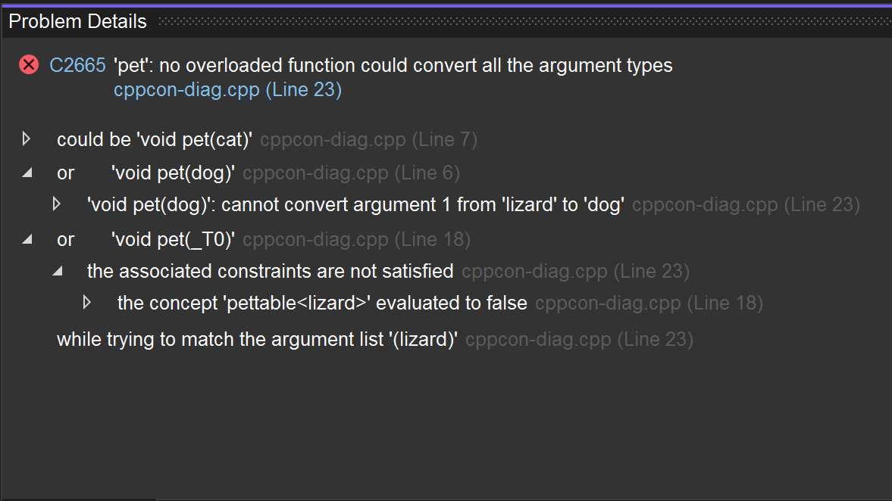

C++-Compilerfehler können lang und unübersichtlich sein. Um dies zu beheben, haben wir ein neues Fenster mit Details zum Problem erstellt, in dem Sie auf strukturierte Weise in Compilerfehlern navigieren können. Das Fenster „Details zum Problem“ kann geöffnet werden, indem Sie auf das Symbol „Details“ für einen Eintrag in der Fehlerliste klicken.

Einträge im Fenster „Details zum Problem“ können erweitert werden, um geschachtelte Informationen zum Fehler vom Compiler anzuzeigen.

