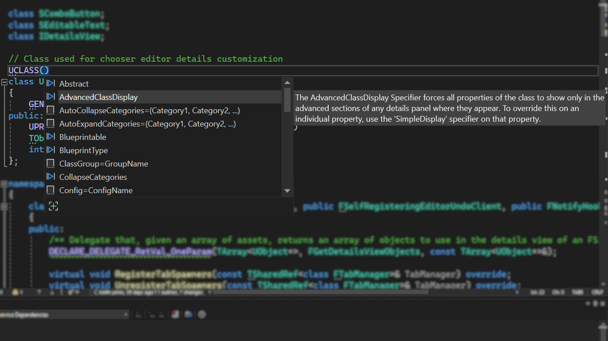

Unreal Engine-Reflexionsspezifizierer sind jetzt als Mitgliederlistenvorschläge in Visual Studio 2022 verfügbar.

Beginnen Sie zunächst mit der Eingabe eines Reflexionsmakros, und die zugehörigen Spezifizierer werden automatisch in Ihren Unreal Engine-Projekten vorgeschlagen. Dieses Feature ist standardmäßig aktiviert. Stellen Sie sicher, dass die „IDE-Unterstützung für Unreal Engine“ in der Workload „Spieleentwicklung mit C++“ im VS Installer aktiviert ist.

