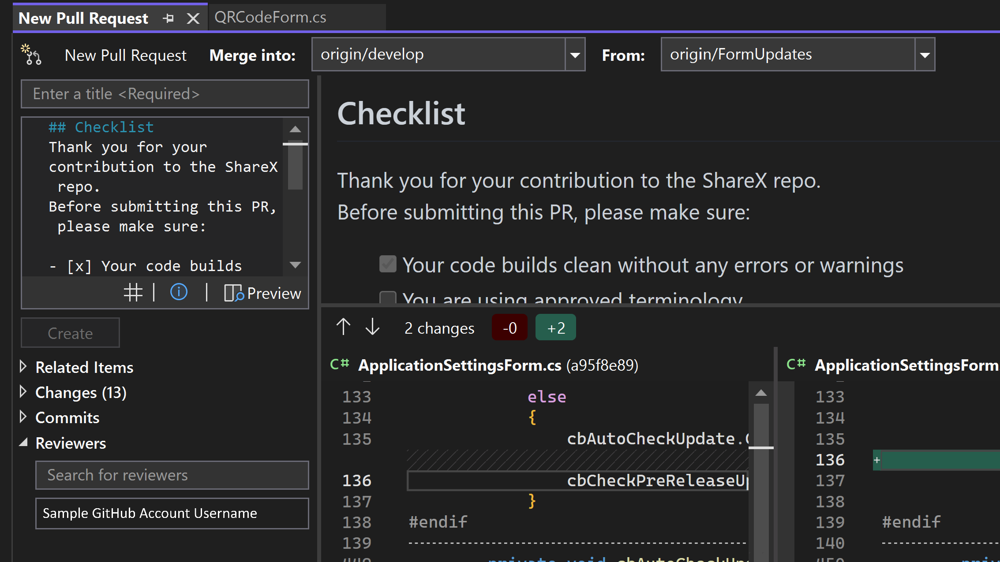

We're delivering new updates to the create a pull request experience. 
- Use the Markdown editor with your pull request descriptions by enabling the feature flag *Git Pull Request - Markdown*
- Add reviewers to your pull request from either Azure DevOps or GitHub
- Avoid errors with notifications and warnings that help you understand the state of your pull request before you create it

Try this out by clicking on the "Create a Pull Request" link that appears on push, or by selecting Git > GitHub or Azure DevOps > New Pull Request from the top level menu. Then, navigate to the Reviewers section and search for the reviewers you'd like to add.

We plan to continue making updates to improve this Pull Request experience, so please share your feedback about this feature [here](https://aka.ms/createPR) and engage with us on [the suggestion ticket in Developer Community](https://developercommunity.visualstudio.com/t/cant-create-pull-request-in-visual-studio-with-new/1017696).
