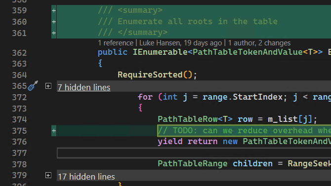

As a continuation of our efforts to improve the diffing experience in Visual Studio, we have introduced a Summary view allowing you to see only the changes in the file with a few lines of context. This makes reviewing your changes in a commit or the comparison between two files much more efficient.

Let us know what you think of this feature by sharing your feedback [here](https://aka.ms/SummaryDiff) and engage with us on the [suggestion ticket in Developer Community](https://developercommunity.visualstudio.com/t/git-differences-show-only-differences-and-omit-lin/1193376).

