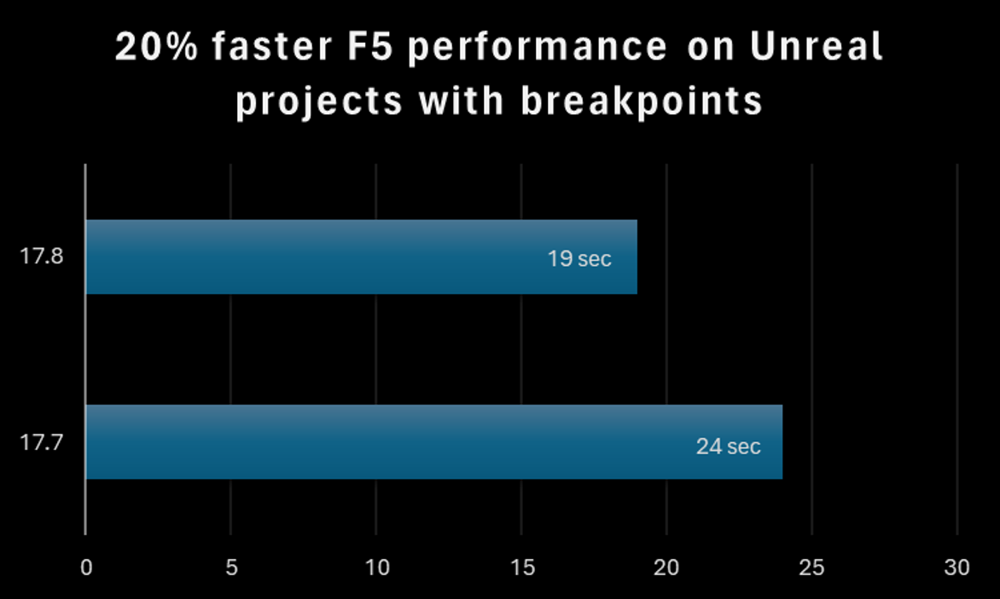

**Rendimiento mejorado del enlace de puntos de interrupción para PDB de Windows.**

Hemos realizado mejoras importantes en el rendimiento de F5 para aplicaciones Windows nativas y administradas. Esta mejora está estrechamente vinculada al número de archivos que contienen puntos de interrupción.  Como resultado, los proyectos de Unreal Editor ahora cargan un 20 % más rápido al usar F5

**Motor Unreal mejorado de C++: optimización de IntelliSense**

Los proyectos de C++ de Unreal Engine ofrecen IntelliSense y colorización más rápidos para un desarrollo de rapidez y eficacia superiores. 

**Comunicación mejorada del asistente de etiquetas Razor/Blazor**

En las herramientas de Razor y Blazor, hemos mejorado la eficacia en nuestra comunicación entre procesos para detectar qué asistentes de etiquetas existen para el contenido de Razor del cliente.   Las soluciones que usen Razor y Blazor deberían ver ahorros significativos de memoria, mejor capacidad de respuesta y un rendimiento de escritura superior.
