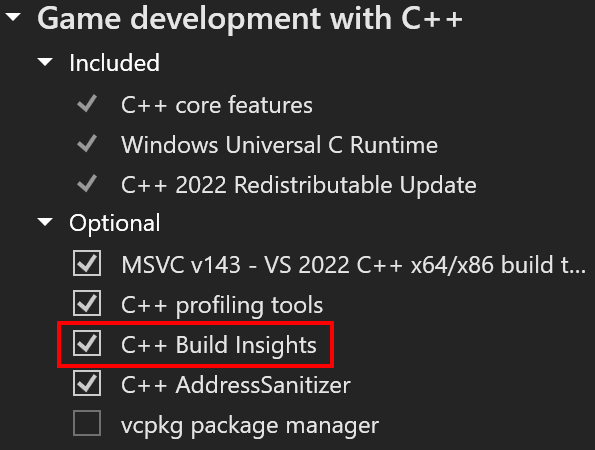

[Build Insights](https://devblogs.microsoft.com/cppblog/introducing-c-build-insights/) ahora está integrado con Visual Studio 2022. Ahora puede ver información adicional relacionada con la generación de funciones. La nueva vista de funciones le proporcionará cuánto tiempo tarda una función durante la compilación, así como el número de ForceInlinees asociados.

Para asegurarse de que Build Insights está habilitado correctamente, asegúrese de que "C++ Build Insights" está seleccionado en el Instalador de Visual Studio en las cargas de trabajo "Desarrollo de escritorio con C++" o "Desarrollo de juegos con C++".

Inicie la captura de seguimiento .etl de Build Insights haciendo clic en un botón. 

Después de la compilación, Build Insights creará un informe de diagnóstico que le permite ver el tiempo de generación de funciones, así como ForceInlinees.

Estamos comprometidos a mejorar continuamente Build Insights. La integración actual de Build Insights que ve actualmente representa solo un fragmento de lo que tenemos en la tienda. ¿Qué flujos de trabajo son importantes para usted? Háganoslo saber en este [vale de Developer Community](https://developercommunity.visualstudio.com/t/Have-full-integration-of-Build-Insights/810960)
