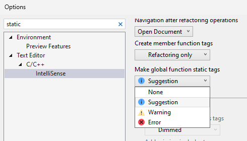

Visual Studio ahora tiene esta característica que permite marcar sin esfuerzo una función global como estática. Si desea restringir el uso de una función global a su ubicación definida y carece de una declaración de reenvío, puede hacer que sea estática.
Al mantener el puntero sobre una función global, aparecerá un mensaje que sugiere que la función se podría convertir en una función estática. Si hace clic en el icono de destornillador y selecciona la opción "Hacer que esta función sea estática", puede realizar este ajuste.

De manera predeterminada, esta característica está habilitada como sugerencia. Para personalizar esta configuración, vaya a Herramientas > Opciones > Editor de texto > C/C++ > IntelliSense.

Para obtener más información, visite la [Entrada de blog Hacer que las funciones globales sean estáticas](https://aka.ms/MakeGlobalFunctionStaticBlogPost).
