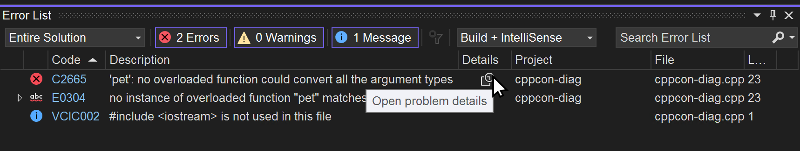
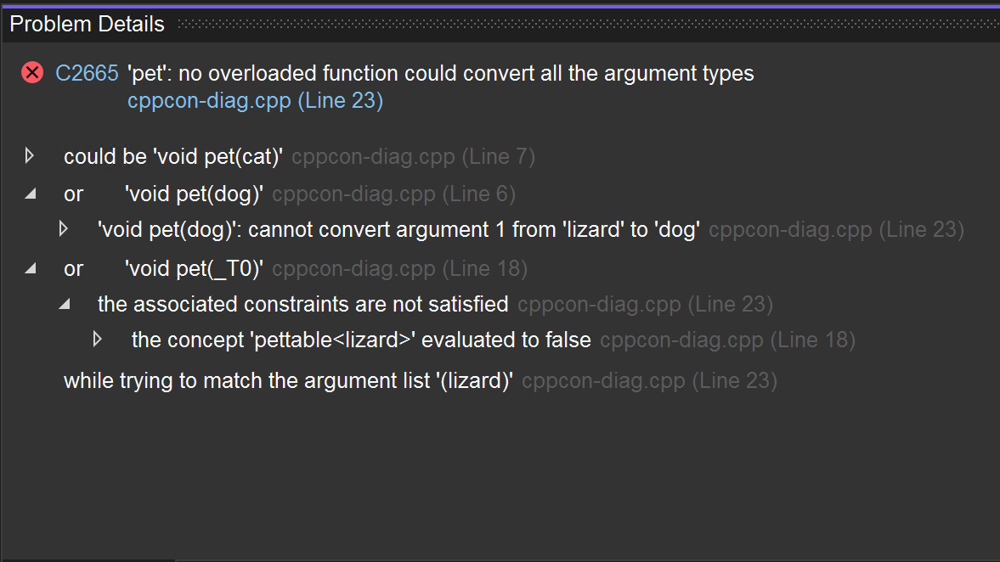

Los errores del compilador de C++ pueden ser largos y difíciles de leer. Para solucionar esto, hemos creado una nueva ventana Detalles del problema que le permite navegar por los errores del compilador de una manera estructurada. La ventana Detalles del problema se puede abrir al hacer clic en el icono Detalles de una entrada de la Lista de errores.

Las entradas de la ventana Detalles del problema se pueden expandir para ver información anidada sobre el error del compilador.

