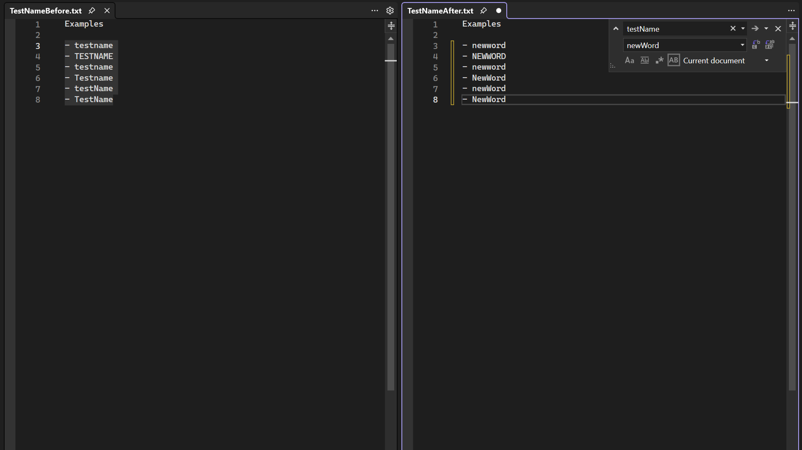

置換を行う場合、コード内の各一致の元の大文字と小文字を保持できるようになりました。 Pascal 大文字と Camel 大文字を取得するには、[文字列の置換] が Pascal 大文字または Camel 大文字でなければならないことに注意してください。 

大文字と小文字の区別は、[置換] ウィンドウの `Alt+V` を使用するか、_[大文字と小文字を保持する]_ オプションをクリックして切り替えます。 

クイック置換 (`Ctrl+H`):

![[正規表現を使用する] の右にある [大文字と小文字を保持する] アイコン](../media/case-preserve-replace-quick-replace-highlighted.png "大文字と小文字を保持するクイック置換")

フォルダーを指定して置換 (`Ctrl+Shift+H`): 

![[正規表現を使用する] の下にある [大文字と小文字を保持する] チェックボックス](../media/case-preserve-replace-replace-in-files-highlighted.png "ファイルで大文字と小文字を保持する置換")

大文字と小文字を保持する置換エクスペリエンスに関するご意見は、開発者コミュニティ チケットに共有してください。[複数のファイル間での大文字小文字を保持する検索と置換](https://developercommunity.visualstudio.com/t/case-preserving-search-replace/580810).
