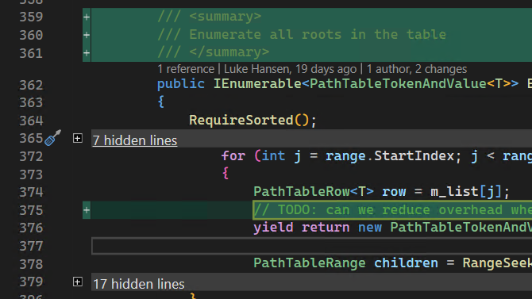

Visual Studio での差分エクスペリエンスを向上させるための取り組みの継続として、概要ビューが導入され、ファイル内の変更のみを数行のコンテキストで表示できるようになりました。 これにより、コミットでの変更や 2 つのファイル間の比較をより効率的に確認できます。

フィードバックを[こちら](https://aka.ms/SummaryDiff)から送っていただき、この機能についてのご意見をお聞かせください。また、[Developer Community の提案チケット](https://developercommunity.visualstudio.com/t/git-differences-show-only-differences-and-omit-lin/1193376)で情報を交換することもできます。

