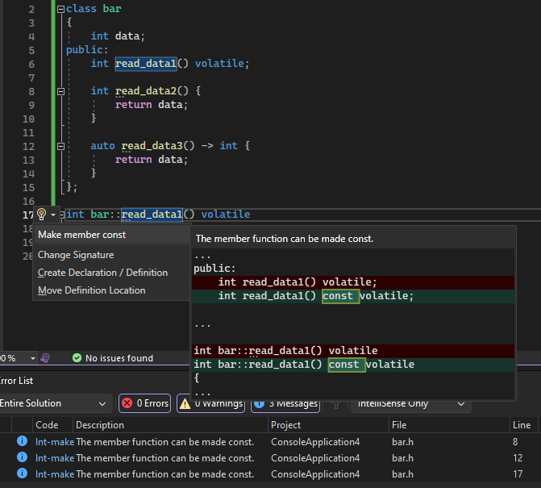

이 기능은 개체의 상태를 논리적으로 수정하지 않아야 하는 경우 멤버 함수를 const로 만들어 우발적인 수정을 방지하고, const 수정을 보장하고, 코드 보안을 강화하는 것을 제안합니다. 멤버 함수를 마우스로 가리키고 전구 아이콘을 클릭하면 멤버 함수 및 동일한 이름의 const가 있는 다른 함수를 만드는 제안에 액세스할 수 있습니다.

기본적으로 이 기능은 제안으로 설정되어 있으며 도구 > 옵션 > 텍스트 편집기 > C/C++ > 코드 스타일 > Linter에서 특정 요구 사항 및 기본 설정에 따라 설정을 사용자 지정할 수 있습니다.

자세한 내용은 [멤버 함수 Const 만들기 블로그 게시물](https://aka.ms/MakeMemberFunctionConstBlogPost)을 참조하세요.
