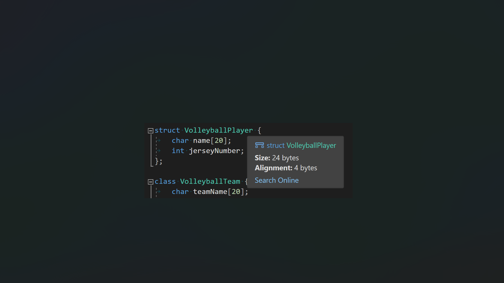

C++에서는 이름 위에 마우스를 올려 클래스, 구조체, 공용 구조체, 기본 형식, 열거형의 크기와 맞춤을 빠르게 확인할 수 있습니다. 코드에 표시되는 모든 위치에서 클래스, 구조체 또는 공용 구조체 이름을 마우스로 가리키면 크기 및 정렬 세부 정보에 액세스하기 위해 해당 선언을 스크롤하고 검색할 필요가 없습니다.

이 기능은 기본적으로 켜져 있습니다. 설정에 액세스하려면 도구 > 옵션 > 텍스트 편집기 > C/C++ > IntelliSense로 이동합니다.

