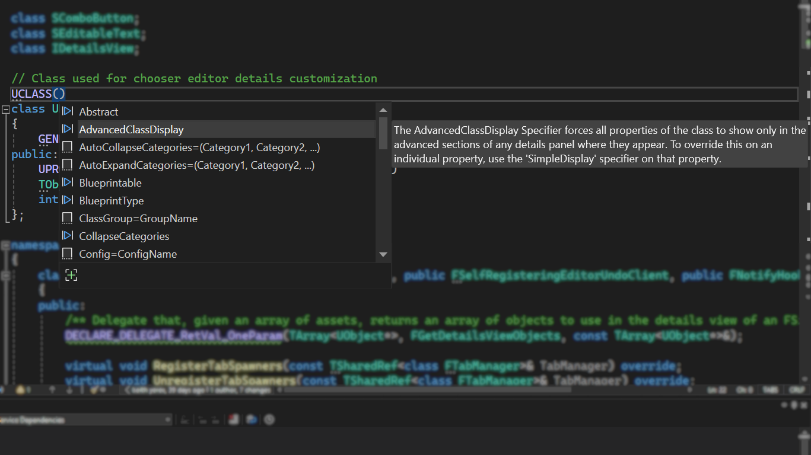

이제 Visual Studio 2022에서 Unreal Engine 리플렉션 지정자를 멤버 목록 제안으로 사용할 수 있습니다.

시작하려면 리플렉션 매크로를 입력하기 시작합니다. 그러면 관련 지정자가 Unreal Engine 프로젝트에 자동으로 제안됩니다. 이 기능은 기본적으로 활성화되어 있습니다. VS 설치 프로그램의 "C++를 사용한 게임 개발" 워크로드에서 "Unreal Engine에 대한 IDE 지원"이 사용하도록 설정되어 있는지 확인합니다.

