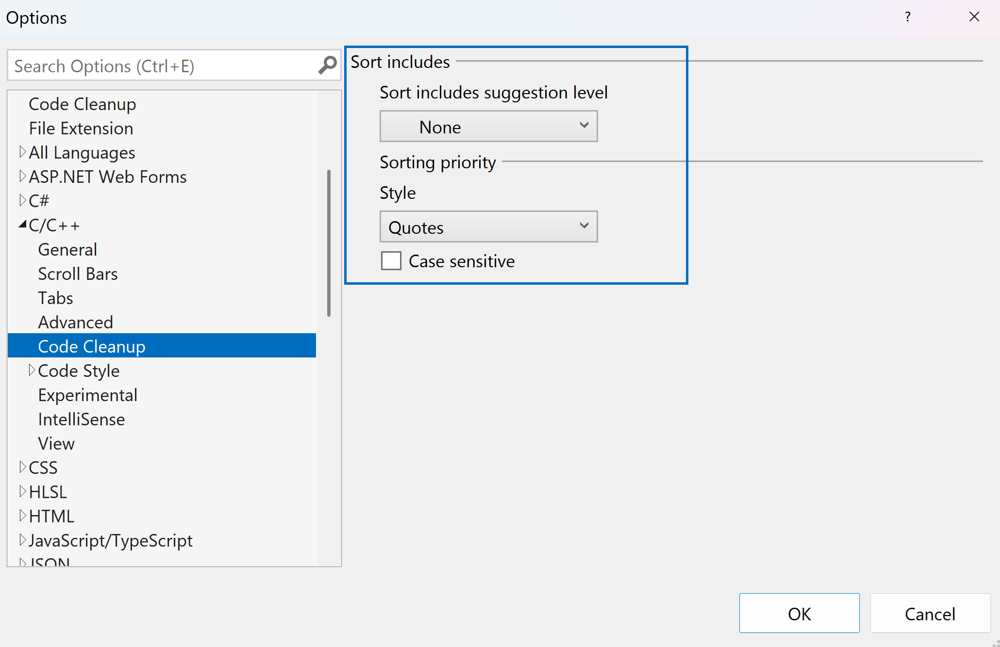

Teraz masz możliwość sortowania dyrektyw #include w celu łatwego zarządzania. Aby skorzystać z tej funkcji, kliknij prawym przyciskiem myszy dowolną instrukcję #include. Najechanie kursorem na opcję dyrektyw #include w menu kontekstowym spowoduje wyświetlenie opcji „Sortuj dyrektywy #include”.

Dodatkowo możesz uzyskać do niego dostęp poprzez wpis Oczyszczania kodu. Najpierw skonfiguruj funkcję Oczyszczanie kodu, dodając funkcję „Sortuj dyrektywy #include” do sekcji Dołączone reguły naprawcze. Umożliwia to płynne sortowanie, które możesz przeprowadzić, klikając ikonę miotły.

Funkcja ta jest domyślnie włączona i można dostosować kolejność sortowania do własnych preferencji. Przejdź do Narzędzia > Opcje > Edytor tekstu > C/C++ > Oczyszczanie kodu, aby dostosować ustawienia.

