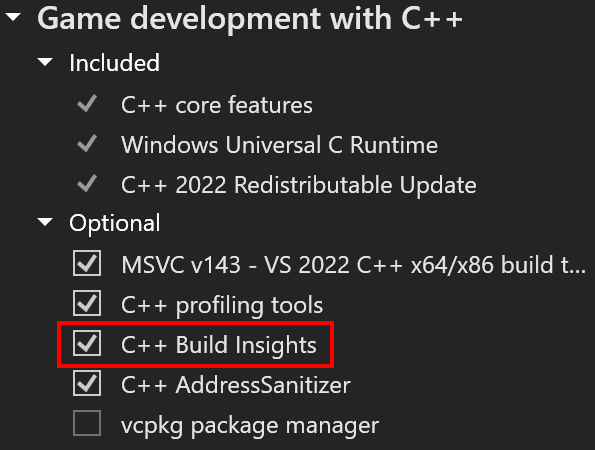
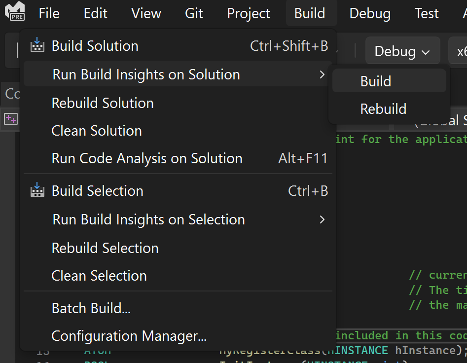
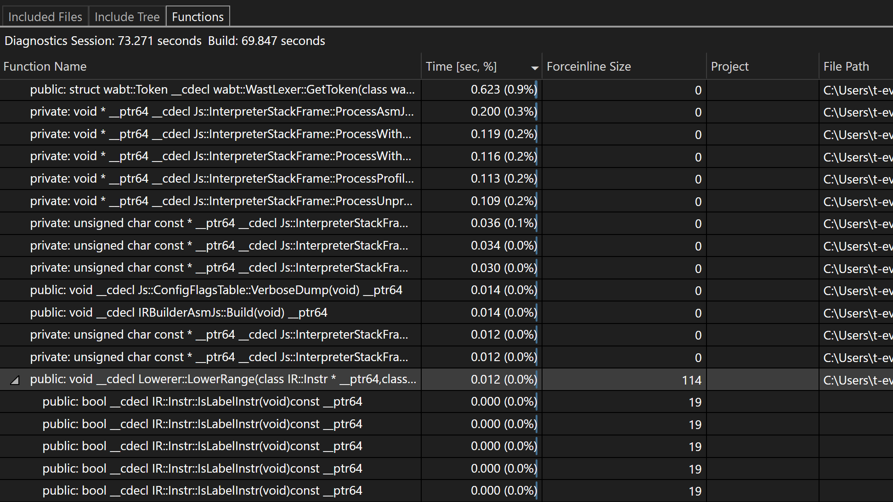

O [Build Insights](https://devblogs.microsoft.com/cppblog/introducing-c-build-insights/) agora está integrado ao Visual Studio 2022! Agora você pode ver informações adicionais relacionadas à geração de função. O novo Modo de Exibição de Funções informará quanto tempo uma função leva durante a compilação, bem como o número de ForceInlinees associados.

Para garantir que o Build Insights está habilitado corretamente, verifique se a opção "Build Insights para C++" está selecionada no Instalador do Visual Studio em cargas de trabalho "Desenvolvimento para desktop com C++" ou "Desenvolvimento de jogos com C++".

Inicie a captura de rastreamento .etl do Build Insights com o clique de um botão. 

Após a compilação, o Build Insights criará um relatório de diagnóstico que permite que você veja o tempo de geração de funções, bem como o ForceInlinees.

Estamos comprometidos em melhorar continuamente o Build Insights. A integração atual do Build Insights que você vê hoje representa apenas um fragmento do que temos reservado para você. Quais fluxos de trabalho são importantes para você? Informe-nos neste [Tíquete da Developer Community](https://developercommunity.visualstudio.com/t/Have-full-integration-of-Build-Insights/810960)
