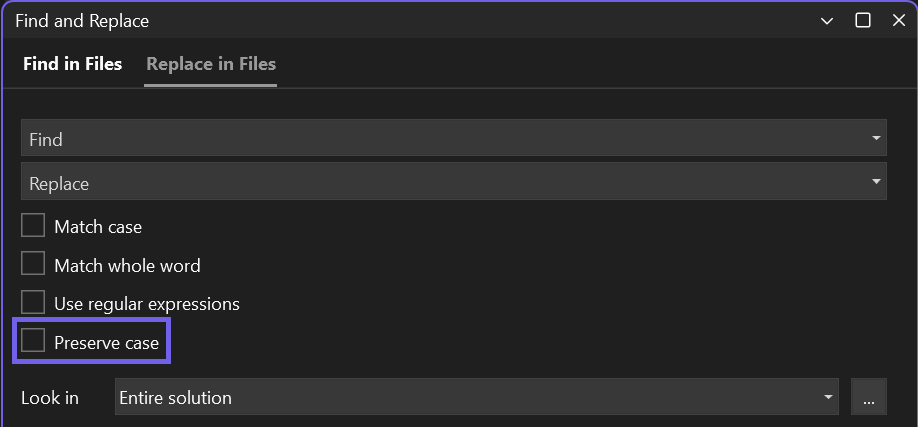

Quando você usa o recurso Substituir, agora você pode preservar a capitalização original de cada correspondência em seu código. Observe que para usar Pascal case e Camel case, sua string de substituição deve estar em Pascal case ou Camel case. 

Alterne a preservação de maiúsculas e minúsculas na janela Substituir com `Alt+V` ou clicando na opção _Preservar maiúsculas e minúsculas_. 

Substituição Rápida (`Ctrl+H`):

Substituir nos Arquivos (`Ctrl+Shift+H`): 

Compartilhe suas ideias sobre a experiência de preservação de letras maiúsculas e minúsculas durante a substituição neste tíquete da Developer Community: [Pesquisa sobre a preservação de letras maiúsculas e minúsculas e substituição em vários arquivos](https://developercommunity.visualstudio.com/t/case-preserving-search-replace/580810).
