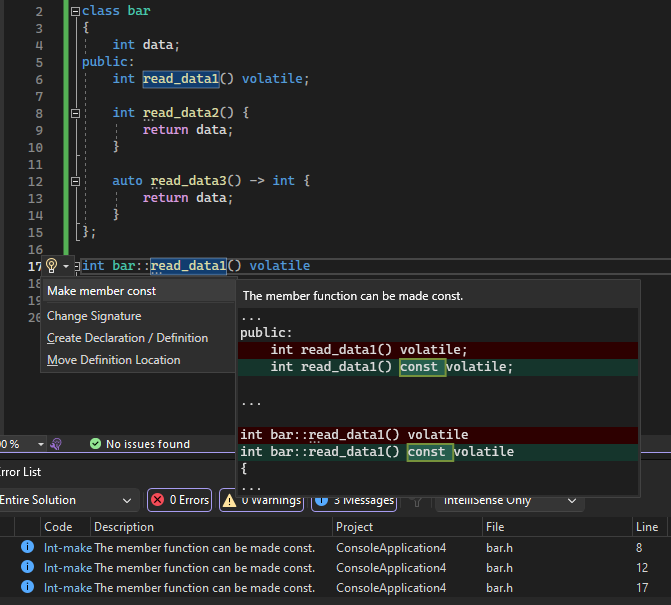
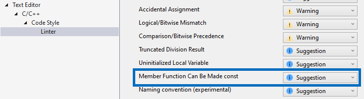

Esse recurso sugere criar uma função membro constante se, logicamente, ela não deve modificar o estado do objeto, ajudando a evitar modificações acidentais, garantindo a correção da constante e aprimorando a segurança do código. Ao passar o mouse sobre a função membro e clicar no ícone de lâmpada, você pode acessar uma sugestão para criar a função membro e outras funções com o mesmo nome "const".

Por padrão, esse recurso é definido como uma sugestão e você pode personalizar as configurações de acordo com seus requisitos e preferências em Ferramentas > Opções > Editor de Texto > C/C++ > Estilo do Código > Linter.

Para obter mais informações, visite [Postagem no Blog sobre a criação de uma função membro constante](https://aka.ms/MakeMemberFunctionConstBlogPost).
