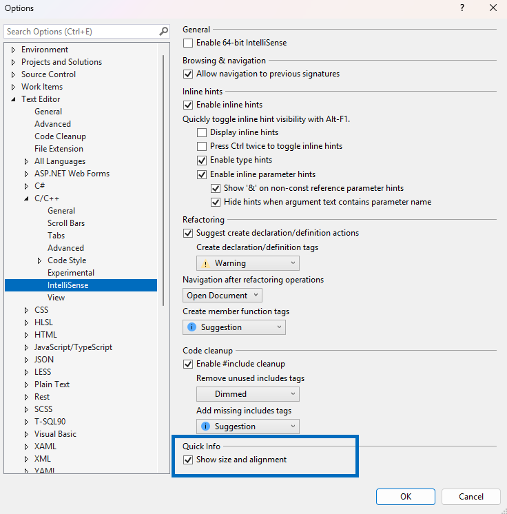

Em C++, você tem a comodidade de verificar rapidamente o tamanho e o alinhamento de classes, structs, uniões, tipos de base e enumerações passando o mouse sobre os respectivos nomes. Você pode passar o mouse sobre os nomes de classe, struct ou união em qualquer lugar em que apareçam no código, sem precisar rolar a tela e procurar suas declarações apenas para acessar os detalhes de tamanho e alinhamento.

Esse recurso está ligado por padrão. Para acessar as configurações, acesse o Ferramentas > Opções > Editor de Texto > C/C++ > IntelliSense.

