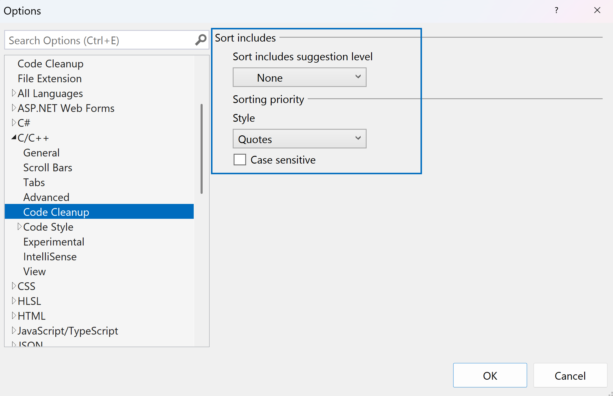

Agora você tem a capacidade de classificar suas diretivas #include para gerenciamento sem esforço. Para utilizar esse recurso, clique com o botão direito do mouse em qualquer instrução #include. Passar o mouse sobre a opção de diretivas #include e o menu de contexto revelará "Classificar diretivas #include".

Além disso, você pode acessá-la por meio da entrada Limpeza de Código. Primeiro, configure a Limpeza de Código adicionando "Classificar diretivas #include (C++)" à seção Reparadores inclusos. Isso permite uma classificação perfeita, que você pode executar clicando no ícone de vassoura.

Esse recurso vem habilitado por padrão e você pode personalizar a ordem de classificação para corresponder às suas preferências. Navegue até Ferramentas > Opções > Editor de Texto > C/C++ > Limpeza de Código para ajustar as configurações.

