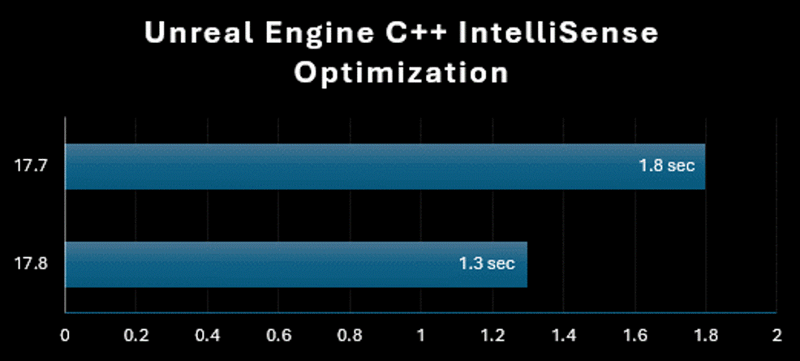

**Улучшена производительность привязки точек останова для PDB-файлов Windows!**

Мы значительно улучшили производительность F5 для собственных и для управляемых приложений Windows. Это улучшение тесно связано с числом файлов, содержащих точки останова.  В результате проекты Unreal Editor теперь загружаются на 20% быстрее при использовании F5

**Улучшенная подсистема C++ Unreal Engine — оптимизация IntelliSense**

Проекты Unreal Engine C++ предлагают ускоренную технологию IntelliSense и цветовую обработку, что обеспечивает более быструю и эффективную разработку. 

**Улучшенное взаимодействие с помощником по тегам Razor/Blazor**

В инструментах Razor и Blazor повышена эффективность взаимодействия между процессами для обнаружения вспомогательных тегов существующих для содержимого Razor клиента.   Решения, использующие Razor и Blazor, должны обеспечить значительную экономию памяти, лучшую скорость реагирования и производительность ввода.
