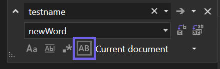

При выполнении замены вы теперь можете сохранять исходный регистр каждого совпадения в вашем коде. Обратите внимание, что для получения регистра Pascal и "верблюжьего" стиля, строка замены должна использовать регистр Pascal или "верблюжий" стиль. 

Переключите сохранение регистра в окне замены с помощью `Alt+V` или путем выбора параметра _Сохранить регистр_. 

Быстрая замена (`Ctrl+H`):

Замена в файлах (`Ctrl+Shift+H`): 

Поделитесь своими мыслями об интерфейсе замены с сохранением регистра в этом билете сообщества разработчиков: [Поиск и замена с сохранением регистра в нескольких файлах](https://developercommunity.visualstudio.com/t/case-preserving-search-replace/580810).
