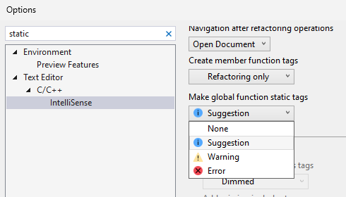

Visual Studio теперь содержит возможность, которая позволяет легко пометить глобальную функцию как статическую. Если вы хотите ограничить использование глобальной функции определенным расположением и у нее отсутствует опережающее объявление, вы можете сделать ее статической.
При наведении курсора на глобальную функцию появится запрос, предлагающий возможность ее преобразования в статическую функцию. Щелкнув значок отвертки и выбрав параметр "Сделать эту функцию статической", вы можете внести это изменение.

По умолчанию эта возможность включена в качестве предложения. Этот параметр можно настроить в разделе "Средства" > "Параметры" > "Текстовый редактор" > "C/C++" > "IntelliSense".

Дополнительные сведения см. в [записи блога о превращении глобальных функций в статические](https://aka.ms/MakeGlobalFunctionStaticBlogPost).
