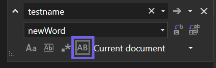
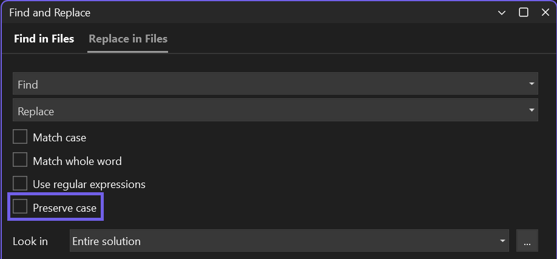

Değiştirme işlemi yaptığınızda, artık kodunuzdaki her eşleşmenin özgün büyük/küçük harflerini koruyabilirsiniz. Baş harfleri büyük harf ve orta harfi büyük harf yazımını edinmek için Değiştirme dizenizin baş harfinin büyük harf veya orta harfinin büyük harf olması gerektiğini unutmayın. 

Değiştirme penceresinde `Alt+V` ile veya _Büyük/küçük harf durumunu koru_seçeneğine tıklayarak büyük/küçük harf durumunu korumayı değiştirin. 

Hızlı Değiştirme (`Ctrl+H`):

Dosyalarda Değiştirme (`Ctrl+Shift+H`): 

Bu Geliştirici Topluluğu biletinde büyük/küçük harf durumunu koruyarak değiştirme deneyimi hakkındaki düşüncelerinizi paylaşın: [Birden Çok Dosyada Büyük/Küçük Harf Durumunu Koruyarak Arama ve Değiştirme](https://developercommunity.visualstudio.com/t/case-preserving-search-replace/580810).
