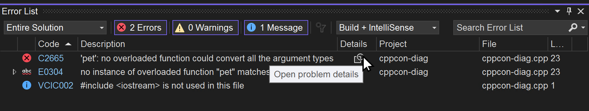

C++ derleyici hataları uzun ve yönetilmesi zor olabilir. Bu sorunu çözmek için derleyici hataları arasında yapılandırılmış bir şekilde gezinmenize olanak tanıyan yeni bir Sorun Ayrıntıları penceresi oluşturduk. Hata Listesindeki bir girişte Ayrıntılar simgesine tıklayarak Sorun Ayrıntıları penceresini açabilirsiniz.

Hata Ayrıntıları penceresindeki girişler, derleyicideki hatayla ilgili iç içe bilgileri görüntülemek amacıyla genişletilebilir.

