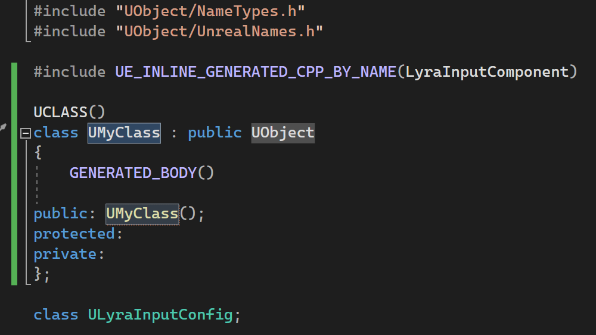

Visual Studio 2022 中现在提供特定于 Unreal Engine 的代码片段。 我们包含了一系列常见的核心 Unreal Engine 宏代码片段。 

首先，开始在编辑器窗口中键入，UE 代码片段将开始显示为 Unreal Engine 项目中的成员列表项。 按 Tab 或 Enter 创建代码片段。

支持的代码段列表
- UClass
- UClassExported
- UENUM
- UFUNCTION
- UINTERFACE
- UINTERFACEExported
- UPROPERTY
- USTRUCT
- USTRUCTExported
- UELOG
- SWidget
- TActorRange
- TObjectRange
- WITH_EDITOR
