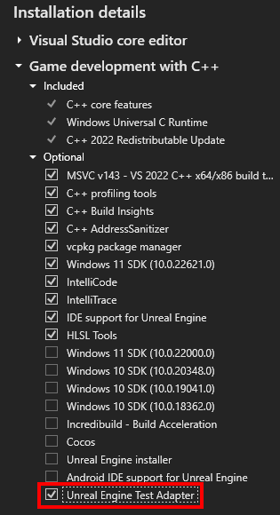
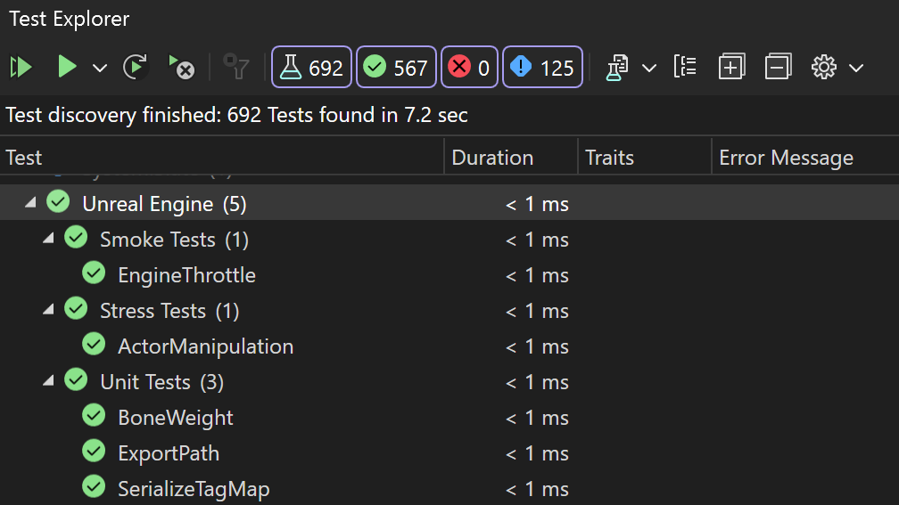

现在可以在 Visual Studio 中管理和运行 Unreal Engine 测试。 

为了确保正确启用虚幻引擎测试适配器，请在 Visual Studio 安装程序的“使用 C++ 的游戏开发”工作负载下仔细检查是否选择了“虚幻引擎测试适配器”。 还需要 Unreal Engine 插件 [Visual Studio 集成工具](https://learn.microsoft.com/visualstudio/gamedev/unreal/get-started/vs-tools-unreal-install)。

安装 UE 测试适配器后，打开 Visual Studio 时，虚幻引擎测试将自动显示。 若要查看测试，可以使用 {KeyboardShortcut:TestExplorer.ShowTestExplorer} 打开测试资源管理器。 使用新的 Unreal Engine 测试适配器，可以轻松管理和运行测试。
