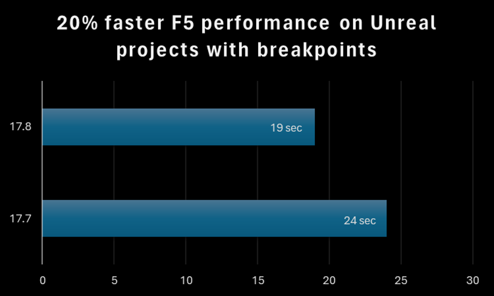
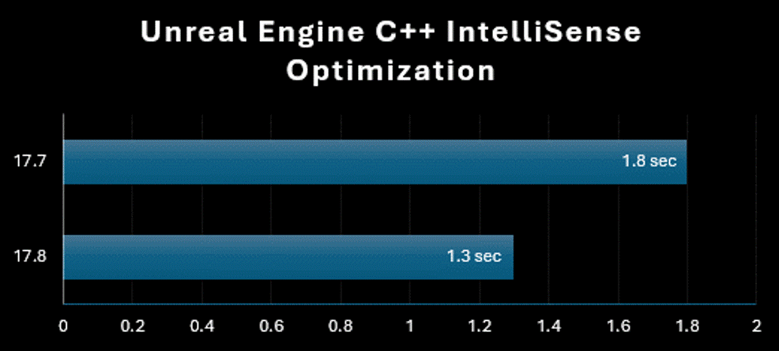

**增強 Windows PDB 的中斷點繫結效能！**

我們對原生和受控 Windows 應用程式的 F5 效能進行了顯著改善。 這項改善與包含中斷點的檔案數目密切相關。  因此，使用 F5 時，Unreal 編輯器專案現在的載入速度快 20%

**增強 C++ Unreal Engine – IntelliSense 最佳化**

Unreal Engine C++ 專案提供更快的 IntelliSense 和顏色標示，進而更快速且更有效率地進行開發。 

**改善 Razor/Blazor 標記協助程式通訊**

在 Razor 和 Blazor 工具中，我們改善了跨處理序通訊的效率，以探索客戶的 Razor 內容有哪些標記協助程式存在。   使用 Razor 和 Blazor 的解決方案應會看到顯著的記憶體節省、更好的回應性和鍵入效能。
